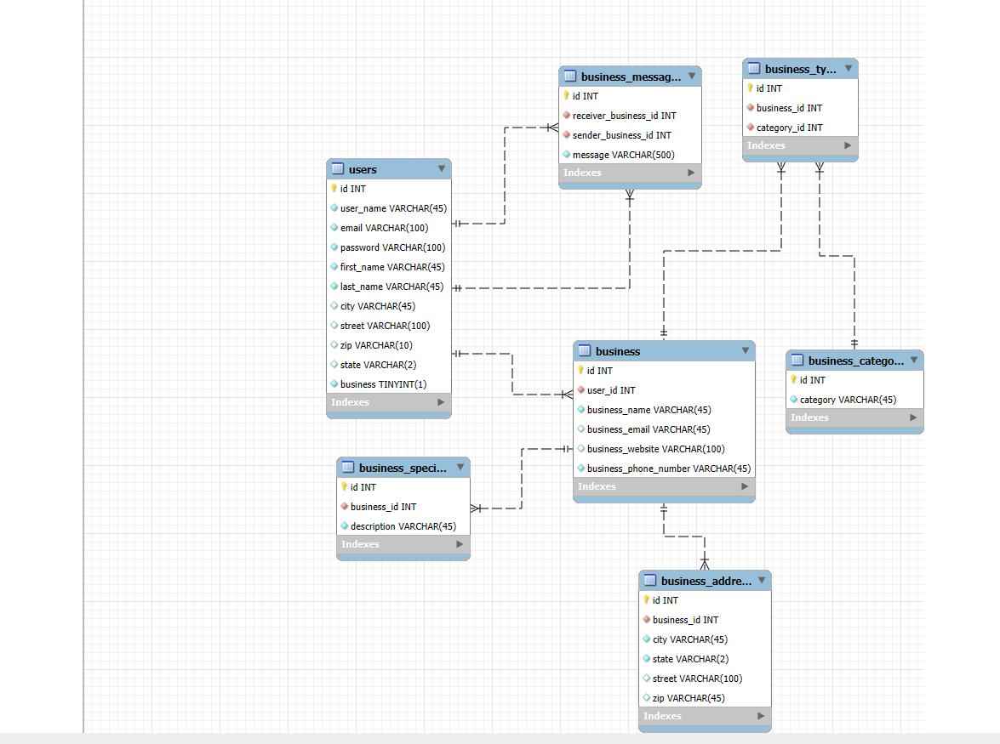

# We Network

## To be able to network and communicate bussiness to consumer.

### Data Overview and Relationships
Data being used and categorize would be "users" (one and only one), "business messages" (one or many), "business" (one and only one, one or many), "business type" (one or many), "business category" (one and only one), "business address" (one or many), "business specials" (one or many).

### Data Visualization - EER Diagram

### Database Information
1. Choosing a database
  * For my database I decided to go with Google Cloud Platform Cloud SQL
  * Created an accout with GCP, create a Cloud SQL instance, choose MySQL from the list of Database Engines, enable API, review pricing and conditions, and create instance and store password.
2. Connect to MySQL Workbench
  * Create a new connection on MySQL Workbench and provide the connection the GCP credentials.
  * Provide the password and connect with the database.
3. Creating Database and Seeding Data
  * Wtite down mysql queries to create database and tables or use mysql workbench features to create database and tables 
  * I will provide my initialize sql files in this repository.
4. Create Local Repository
  * Create a new project/folder and give it a name.
  * Open up a termina and cd into the correct directory of the new project.
  * Run command 'npm init -y' to initialize node project.
  * Install dependencies my project will rely on such as: mysql, dotenv, express, jsonwebtoken, argon2, etc.
  * Create .env under main directory and create environment variables that my project will rely on and I want to keep hidden from github.
  * I will provide my .env file with my GPC credentials that i will need to use for my express app to connect to my database instance.
  * I made sure I created my .gitignore file and added my .env and node_modules to the list.
5. Create an Express Server 
